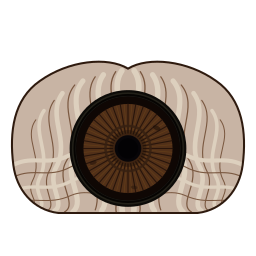

# Argus Capture

<p align="center">
  
</p>

Argus Capture is an camera tethering application that uses voice-to-text AI to control the camera and the shooting.

Argus Capture is named after [Argus](https://en.wikipedia.org/wiki/Argus_Panoptes) which is a many-eyed giant in Greek mythology.

## Features


## Compiling the source

**Argus Capture** requires

* [rust](https://rust-lang.org/)
* [cargo](https://rust-lang.org/)
* [rst2man](https://docutils.sourceforge.io/)
* [pandoc](https://pandoc.org/)
* [texlive](https://www.tug.org/texlive/)

```sh
dnf install rust rust-analyzer rustfmt rust-src rust-std-static cargo
```

### Release build

The following commands will install **Argus Capture** in the `/usr/local` hierarchy.

```sh
git clone https://github.com/ArgusCapture/ArgusCapture.git
cd ArgusCapture
cargo build --release
sudo cargo install --root /usr/local/
```

### Debug build

The following commands will create a `DEBUG` version of **Argus Capture**.

```sh
git clone https://github.com/ArgusCapture/ArgusCapture.git
cd ArgusCapture
cargo build
cd target/debug
```

## Contributing

Contributions to **Argus Capture** are managed on [GitHub.com](https://github.com/ArgusCapture/ArgusCapture/)

* [Ask a question](https://github.com/ArgusCapture/ArgusCapture/discussions)
* [Raise an issue](https://github.com/ArgusCapture/ArgusCapture/issues)
* [Feature request](https://github.com/ArgusCapture/ArgusCapture/issues)
* [Code submission](https://github.com/ArgusCapture/ArgusCapture/pulls)

Contributions are most welcome !

Please, consult our [Code of Conduct](./CODE_OF_CONDUCT.md) policies for interacting in our
community.

Consider giving the project a [star](https://github.com/ArgusCapture/ArgusCapture/stargazers) on
[GitHub](https://github.com/ArgusCapture/ArgusCapture/) if you find it useful.


## License

[GNU General Public License v3.0](https://www.gnu.org/licenses/gpl-3.0.en.html)
